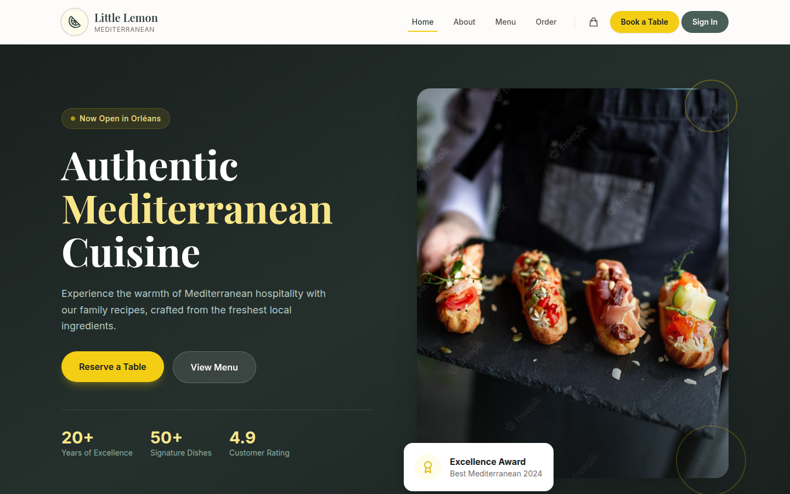

# Little Lemon Restaurant

A modern, full-stack web application for the Little Lemon Mediterranean restaurant. Features online ordering with real-time delivery tracking, table reservations, user authentication, and a Progressive Web App experience.



## Features

### Online Ordering
- Browse menu with categories (Starters, Mains, Desserts, Drinks)
- Shopping cart with quantity management
- **Delivery** with real-time tracking via Stuart API
- **Pickup** option with estimated ready time
- Order history for authenticated users

### Table Reservations
- Interactive booking form with date/time selection
- Party size selection (1-20 guests)
- Special occasion options (Birthday, Anniversary, Business, etc.)
- Special requests field
- Reservation management and cancellation

### Authentication
- Email/password registration and login
- Google OAuth integration
- Facebook OAuth integration
- Protected routes for orders and reservations
- User profile management

### Technical Highlights
- **PWA Ready**: Installable app with offline capabilities
- **SSR Enabled**: Server-side rendering for fast initial load
- **Responsive Design**: Mobile-first approach
- **Accessibility**: WCAG 2.1 AA compliant
- **Animations**: Smooth transitions with Framer Motion

## Tech Stack

| Category | Technology |
|----------|------------|
| Framework | React 19 + React Router 7 (SSR) |
| Language | TypeScript |
| Styling | Tailwind CSS 4 |
| State Management | Redux Toolkit |
| Database & Auth | Supabase |
| Delivery API | Stuart |
| Forms | Formik + Yup |
| Animations | Framer Motion |
| Icons | Lucide React |
| Testing | Vitest + Testing Library |
| Build Tool | Vite |

## Getting Started

### Prerequisites

- Node.js 18+ or Bun
- A Supabase project ([supabase.com](https://supabase.com))
- Stuart API credentials (for delivery feature)

### Installation

```bash
# Clone the repository
git clone https://github.com/yourusername/little-lemon-webapp.git
cd little-lemon-webapp

# Install dependencies
bun install
# or
npm install

# Copy environment variables
cp .env.example .env
```

### Environment Variables

Create a `.env` file with the following variables:

```env
# Supabase
VITE_SUPABASE_URL=your_supabase_url
VITE_SUPABASE_ANON_KEY=your_supabase_anon_key

# Stuart Delivery API (optional)
STUART_API_CLIENT_ID=your_stuart_client_id
STUART_API_CLIENT_SECRET=your_stuart_client_secret
STUART_API_ENV=sandbox  # or 'production'
```

### Database Setup

Run the SQL schema in your Supabase SQL Editor:

```bash
# The schema is located at:
supabase/schema.sql
```

This creates the following tables with Row Level Security:
- `profiles` - User profiles (auto-created on signup)
- `orders` - Order history with items and delivery info
- `reservations` - Table reservations

### OAuth Configuration

Configure OAuth providers in Supabase Dashboard:

1. Go to **Authentication > Providers**
2. Enable **Google** and add your OAuth credentials
3. Enable **Facebook** and add your App ID/Secret
4. Set **Site URL** to your app URL
5. Add **Redirect URLs**: `http://localhost:5173/auth/callback`

### Development

```bash
# Start development server
bun run dev
# or
npm run dev

# The app will be available at http://localhost:5173
```

### Available Scripts

| Command | Description |
|---------|-------------|
| `bun run dev` | Start development server |
| `bun run build` | Build for production |
| `bun run start` | Start production server |
| `bun run typecheck` | Run TypeScript checks |
| `bun run test` | Run tests in watch mode |
| `bun run test:run` | Run tests once |
| `bun run test:coverage` | Run tests with coverage |
| `bun run test:accessibility` | Run accessibility tests |

## Project Structure

```
app/
├── components/
│   ├── auth/           # Authentication modal, protected routes
│   ├── cart/           # Shopping cart sidebar
│   ├── home/           # Hero, specials, testimonials
│   ├── menu/           # Menu items, categories, filters
│   ├── order/          # Checkout, delivery form
│   ├── reservations/   # Booking form, confirmation
│   ├── root/           # Navbar, footer, layout
│   └── ui/             # Reusable UI components
├── data/               # Menu items, static data
├── lib/                # Supabase client, database functions, Stuart API
├── providers/          # Auth, Redux, Loading providers
├── routes/             # Page components
├── store/              # Redux store, cart slice
└── root.tsx            # App shell with providers
```

## Design System

### Colors

| Color | Hex | Usage |
|-------|-----|-------|
| Primary | `#495E57` | Headers, buttons, navigation |
| Secondary | `#F4CE14` | Accents, highlights, CTAs |
| Accent | `#EE9972` | Decorative elements |
| Neutral | `#EDEFEE` | Backgrounds |

### Typography

- **Display**: Markazi Text (headings)
- **Body**: Karla (body text)

## Deployment

### Docker

```bash
# Build the image
docker build -t little-lemon .

# Run the container
docker run -p 3000:3000 little-lemon
```

### Vercel / Netlify

The app is configured for SSR deployment. Make sure to:
1. Set all environment variables
2. Configure build command: `bun run build`
3. Configure start command: `bun run start`

## API Endpoints

The app uses Supabase as the backend. Key database operations:

- `createOrder()` - Create a new order
- `getUserOrders()` - Get user's order history
- `createReservation()` - Book a table
- `getUserReservations()` - Get user's reservations
- `cancelReservation()` - Cancel a reservation

## Contributing

1. Fork the repository
2. Create your feature branch (`git checkout -b feature/amazing-feature`)
3. Commit your changes (`git commit -m 'Add amazing feature'`)
4. Push to the branch (`git push origin feature/amazing-feature`)
5. Open a Pull Request

## License

This project is licensed under the MIT License - see the [LICENSE](LICENSE) file for details.

---

**Little Lemon** - Mediterranean flavors in Orléans, France
